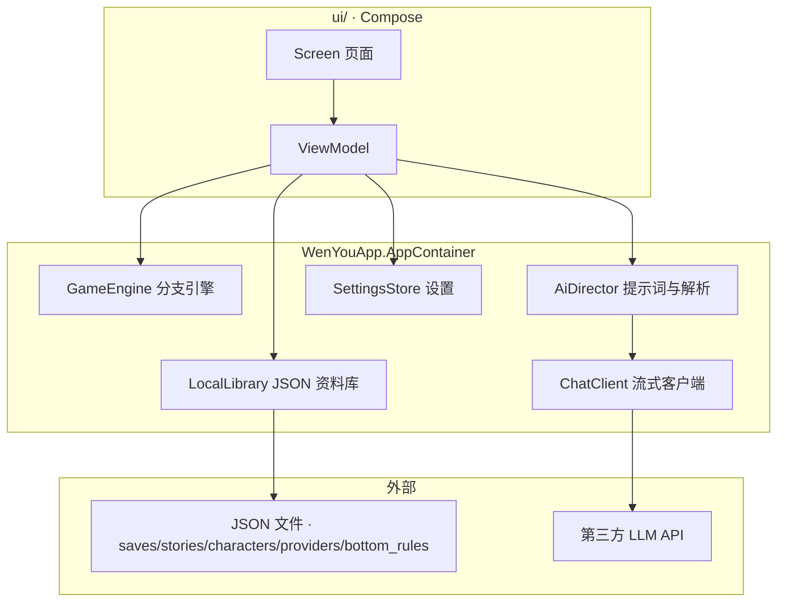
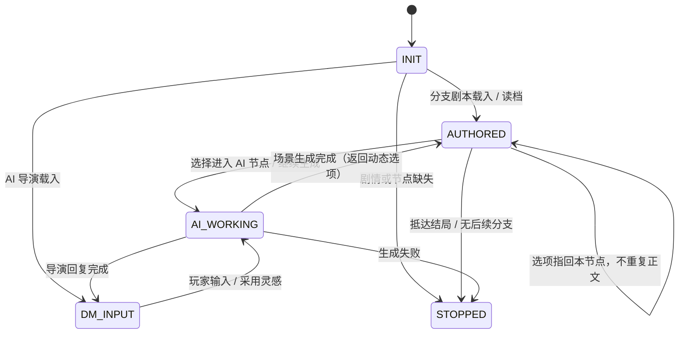
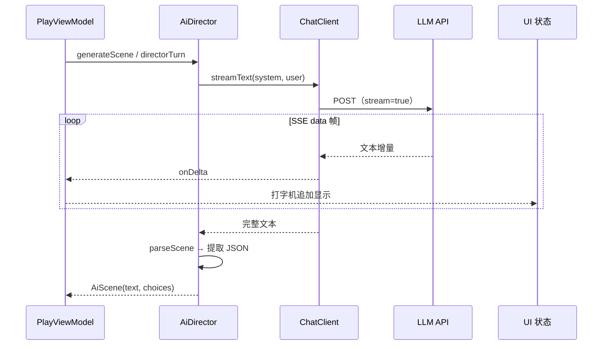

# 文游 β（WenYou TextQuest Beta）

运行于 Android 的文字冒险游戏平台：支持完全离线的分支剧情，也支持接入第三方大模型 API 获得 AI 场景生成与 AI 导演自由模式。技术栈为 Kotlin、Jetpack Compose、Material 3；所有数据以 JSON 保存在应用私有目录。

## 功能

- 节点式分支引擎：节点分为叙述（`NARRATION`）、AI 生成场景（`AI`）、结局（`ENDING`）三类。支持节点进入效果、选项显示条件与选择效果、数值变量、场景标记、掷骰，以及 `${变量}` 文本插值，实现在 `data/engine/GameEngine.kt`。
- 角色卡：以名字、Emoji、性格、说话风格、背景、台词示范等字段构成角色人设，编辑后注入 AI 系统提示；对局中可维护角色的 0..100 状态值与标记，定义见 `data/model/CharacterMetrics.kt`。
- 底层基调（不可动摇规则）：独立、可复用实体，可新建多条；每个角色可多选要执行的底层基调。AI 注入时先执行底层基调、再按人设扮演，冲突时以此层为准，见 `data/model/Models.kt` 的 `BottomRule` 与 `AiDirector.personaCard`。
- 多品牌 AI 接入：OpenAI 兼容协议覆盖 DeepSeek、Kimi、GLM、Qwen、豆包、OpenRouter、硅基流动、小米 MiMo、Ollama 等服务；Anthropic 与 Gemini 分别走 Messages API 与 `streamGenerateContent` 原生协议。统一为 SSE 流式输出，提供连接测试与模型列表拉取。
- AI 正文清洗：生成结果统一剥除 markdown（加粗/列表/标题/斜体/引用/代码块）、剔除导演式思考泄漏行，思考内容独立展示不混入角色回复。DeepSeek 推理模型（`deepseek-reasoner`）自动免 `temperature`、放宽超时与 `max_tokens`，并兼容 `reasoning_content`/`reasoning` 思考字段。
- 分享与导入：剧情与角色可生成分享码（WY2 deflate 压缩文本）或二维码（单张优先，过大自动拆成多片 QR Book 轮播）；支持粘贴分享码、相机扫码、相册一次多选整套二维码导入，按 id 只补不覆盖并提示重复内容。
- 对局存档：支持随时存档、主页续玩，以及整包 JSON 导出 / 导入。

## 玩法模式

| 模式 | 玩法 | 是否依赖 AI | 适用场景 |
| --- | --- | --- | --- |
| 分支剧本（`SCRIPT`） | 作者预编排节点与选项，引擎按条件、效果、掷骰推进 | 否，完全离线 | 结构可控的多线叙事、多结局 |
| AI 场景节点 | 分支骨架中插入 `AI` 节点，由模型生成正文与动态选项，可通过主线出口接回作者节点 | 是 | 框架稳定、局部自由发挥 |
| AI 导演（`AI_DIRECTOR`） | 整局自由对话推进，模型同时扮演角色与主持人，维护世界观与人设一致性 | 是 | 开放结局的探索式叙事 |

## 架构总览

应用按“UI → ViewModel → 容器服务 → 引擎 / 网络 / 持久化”分层。`WenYouApp.AppContainer` 为手写依赖注入入口，不引入 Hilt：



对局页由 `PlayViewModel` 统一驱动状态机，三种玩法共用同一套阶段：



对局页「重开本局」会丢弃当前会话并重新执行开局流程：分支剧本回到起始节点（若起始节点为 AI 节点则直接进入 `AI_WORKING`），AI 导演剧本回到 `DM_INPUT`。

## AI 生成链路

每次生成先拼提示词（人设卡、最近剧情、变量与角色状态快照、底层基调），再以 SSE 逐帧接收文本增量驱动打字机，结束后把完整输出解析为结构化结果并做正文清洗（剥 markdown、剔思考泄漏）：



### 协议适配

三类 `ProviderKind` 的端点与解析路径如下，实现集中在 `data/llm/ChatClient.kt`：

| 协议 | 聊天端点 | 增量字段 | 模型列表端点 |
| --- | --- | --- | --- |
| OpenAI 兼容 | `POST {base}/chat/completions` | `choices[0].delta.content`，推理模型回退 `reasoning_content` / `reasoning` | `GET {base}/models`，取 `data[].id` |
| Anthropic | `POST {base}/v1/messages` | `content_block_delta` 的 `delta.text` | `GET {base}/v1/models`，取 `data[].id` |
| Gemini | `POST {base}/models/{model}:streamGenerateContent?alt=sse` | `candidates[0].content.parts[].text` | `GET {base}/models?pageSize=1000`，取 `models[].name`（去 `models/` 前缀） |

模型输出约定为单个 JSON 对象，由 `AiDirector.parseScene` 解析：

```json
{
  "text": "本幕正文……",
  "choices": [
    { "text": "选项一" },
    { "text": "带主线出口的选项[to:node_id]" }
  ]
}
```

`[to:节点id]` 标记仅用于 AI 场景节点接回作者分支；解析失败时整段文本作为正文保留，不中断对局。

## 版本

文游 β 内置全年龄角色与剧情，并提供可单独开启的直向成人预设。

构建配置见 `app/build.gradle.kts`，成人内容开关只影响列表过滤，不删除本地数据。

### 内容分级

剧情与角色可标记为成人内容，并受设置中的成人内容开关约束；未标记的内容归为全年龄。

## 数据与预设

运行时数据分五个 JSON 文件存于应用私有目录，字段均对手工编辑友好：

| 文件 | 内容 | 维护入口 |
| --- | --- | --- |
| `providers.json` | AI 服务档案（品牌、baseUrl、Key、模型） | 「AI 服务」页 |
| `characters.json` | 角色卡（含底层基调多选 `bottomRuleIds`） | 「角色」页 |
| `stories.json` | 剧情节点图与会话设置 | 「剧情」编辑器 |
| `saves.json` | 存档（含日志与角色状态快照） | 对局内 / 主页 |
| `bottom_rules.json` | 底层基调（不可动摇规则）实体 | 设置 → 底层基调 |

内置题材预设以 `assets/presets/*.json` 提供，启动时检查合并状态：尚未合并过的包按 id 并入资料库，规则为只补不覆盖；已合并的文件记录在 `SettingsStore` 的 `preset_files_applied_v2` 中，避免重复导入。β 的预设与 α 同源，只裁掉 `orientation` / `lgbt` 字段，改动时两个项目需要同步。

## 构建

编译环境要求：`compileSdk 35`、`minSdk 26`、`targetSdk 34`、JDK 17。仓库自带 Gradle wrapper（8.9），可直接用 Android Studio（Ladybug 或更新）打开运行。

命令行构建示例：

```bash
./gradlew :app:assembleBetaDebug
```

构建输出默认位于 Gradle 用户目录的 `caches/wnq-build/WenYouTextQuestBeta`，以避开 OneDrive 文件锁；可用环境变量 `WENYOU_BUILD_DIR` 指定其它位置。

回归与静态检查（13 项 JVM 回归测试）：

```bash
./gradlew :app:testBetaDebugUnitTest :app:lintBetaDebug
```

测试覆盖资料库并发写入与失败保护、分支存读档、节点循环、角色条件、掷骰边界、AI 正文/思考与状态解析、分享码完整性和解压大小限制。网络测试使用本地拦截响应，不需要 API Key。接管审核记录见 [AUDIT.md](AUDIT.md)。

版本号按 `x.yy.zz` 规则维护在 `version.properties`；执行 `./gradlew bumpVersion` 递增：

- `bumpVersion`（默认 / `-Pbump=patch`）：仅 bug 修复，`zz` +1（范围 0–99，满 100 进位到 `yy`）。
- `-Pbump=minor`：新功能或重大变化，`yy` +1 且 `zz` 归零（`yy` 范围 0–9，满 10 进位到 `xx`）。
- `-Pbump=major`：重大架构变化或巨大功能增加，`xx` +1 且 `yy=zz=0`。

`versionCode` 在每次 `bumpVersion` 时单调递增。正式打包前应先执行该任务。

## 目录结构

```text
app/src/main/java/io/wenyou/textquest/
├── CrashLog.kt        崩溃日志多路径落盘（内部 / 外部 / SAF Documents）
├── data/model/        持久化模型，JSON 序列化字段对手工编辑友好
├── data/engine/       分支引擎：条件、效果、掷骰、模板插值，纯逻辑无 IO
├── data/ai/           AI 场景与导演的提示词组装、模型 JSON 输出解析与正文清洗
├── data/llm/          多协议流式客户端与品牌预设目录
├── data/repo/         本地 JSON 资料库与 SharedPreferences 设置
├── data/sample/       首次启动植入的示例角色与剧情
└── ui/                Compose 页面、ViewModel、主题
```

## 贡献者

- [wangmikuwang](https://github.com/wangmikuwang)：项目发起、整体架构与产品设计。
- Little Code Sauce（AI 编程搭档）：功能实现、代码审核与优化、构建与发布流程。

## 设计决策与已知限制

- 未引入 Hilt 与 Room：依赖注入在 `WenYouApp` 中手动完成，持久化直接读写 JSON 文件。资料库内部统一串行写入，先写临时文件再原子替换，成功后才更新对应内存列表；失败会显示错误。多文件整包导入仍不具备跨文件事务，部分文件写入成功后失败时应重新导入完整备份。
- 分享码兼容 WY1/WY2；解压后的 JSON 上限为 8 MiB，截断或超限负载会拒绝导入。超过分享上限的内容请使用设置中的整包 JSON 导出。
- AI 上下文取最近 `historyWindow` 条日志，超出部分自动截断，以避免提示词超长。
- 流式生成结束前不写入对局日志，因此生成过程中无法保存“半句”内容；整段结束后存档即为一致状态。
- AI 生成正文统一清洗（剥 markdown、剔思考泄漏），仅作用于 AI 生成，作者手写节点文本保留原样。
- 底层基调支持独立实体与角色内嵌单条两种来源，均注入人设最底；角色删除某条引用或删除规则时自动摘除关联，避免悬空 id。
- 用户已删除的内置内容不会在后续启动时被自动写回。
