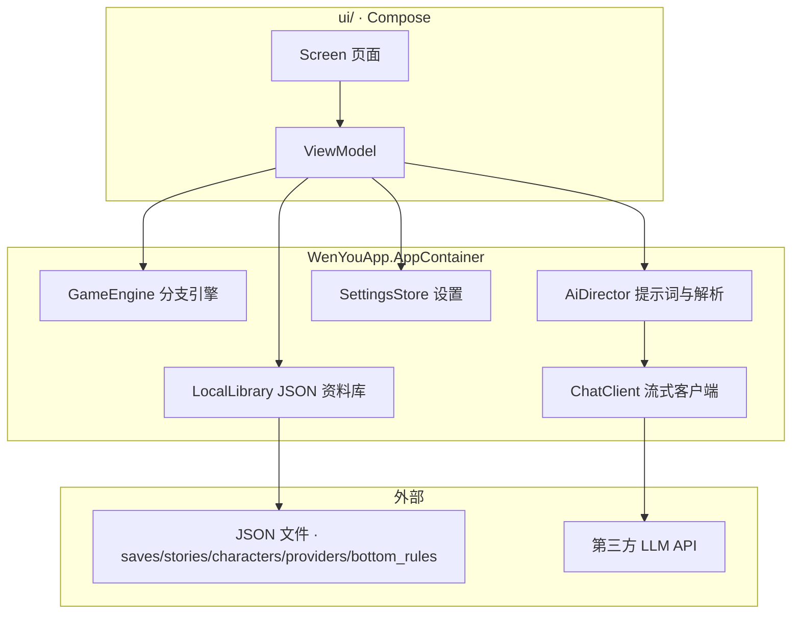
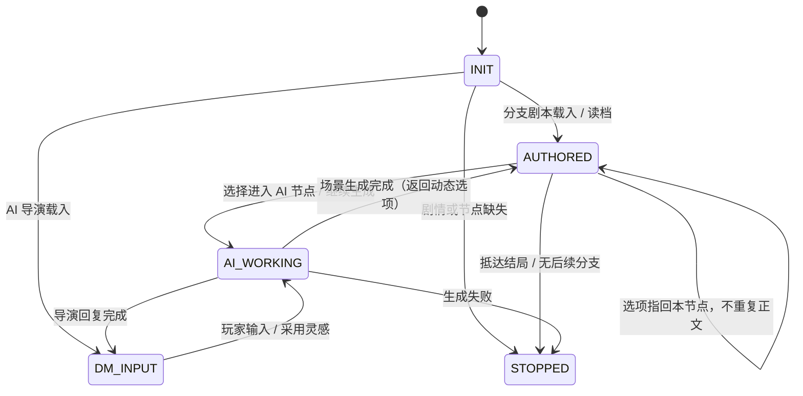
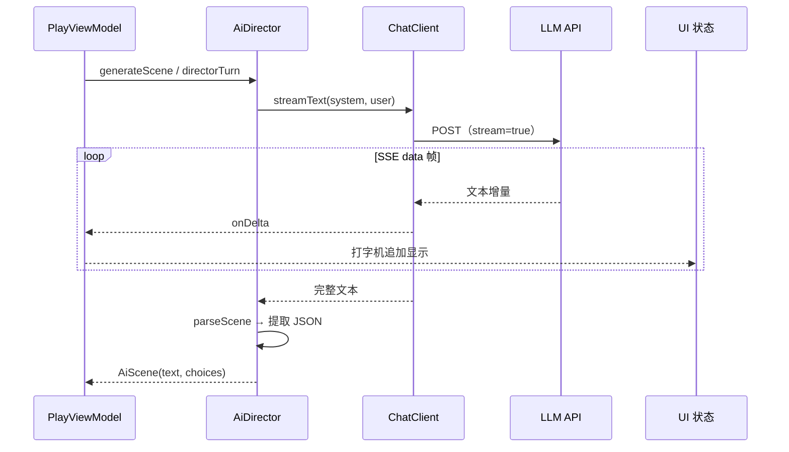

# 星叙（XingXu）

运行于 Android 的文字冒险游戏平台：支持完全离线的分支剧情，也支持接入第三方大模型 API 获得 AI 场景生成与 AI 导演自由模式。技术栈为 Kotlin、Jetpack Compose、Material 3；所有数据以 JSON 保存在应用私有目录。

## 维护更新（5.1.0）

版本 5.1.0，版本代码 92。液态玻璃导航使用配套前景与底色，改善选中项可读性；保留现有内容、图标与自动升级功能，最低支持版本仍为 5.0.0。30 项单元测试、Android Lint、独立 APK 构建及 Android 14 外观和升级门禁设备检查通过。

## 维护更新（5.0.1）

版本 5.0.1，版本代码 91。保留现有图标、内容与自动升级功能，最低支持版本保持 5.0.0。Android Lint 与独立 APK 构建通过。

## 自动更新与升级门禁（5.0.0）

启动应用时自动检查官方最新正式发布；返回前台且距上次检查至少五分钟时再次检查。发现新版本会提示更新，设置页仍可主动检查。点击「下载并升级」后显示真实下载进度，由系统下载管理器持续下载，回到应用可继续查看进度并安装。

完成下载后核对 SHA-256、文件大小、本应用包名、签名与版本，再通过仅开放更新缓存目录的 FileProvider 交给系统安装界面。首次安装更新需允许本应用安装软件，并在系统确认页确认；不支持静默安装。参考 [Android FileProvider](https://developer.android.com/reference/androidx/core/content/FileProvider) 和 [系统安装确认](https://developer.android.com/reference/android/content/pm/PackageInstaller#STATUS_PENDING_USER_ACTION)。升级沿用原包名与签名，保留本地资料。

本仓库 `update-policy.json` 声明最低支持版本，初始为 `minimumVersionCode: 90`、`minimumVersion: "5.0.0"`。从 5.0.0 开始，低于已知最低版本时只显示升级页，不能进入剧情或设置；已取得的策略缓存到本机，断网仍执行。尚未联网获取新策略的设备无法知道后来提高的门槛。提高门槛前必须先发布可用、签名一致的正式安装包，再修改本仓库策略。

已安装的 4.x 客户端没有这一门禁，不能通过新发行版追溯禁止启动；需先手动升级到 5.0.0。兼容原官方安装包命名，旧客户端仍可通过原更新入口获取新版。公开更新请求不使用 AI 服务密钥，不上传用户剧情、存档或配置。

验证：30 项单元测试、Android Lint、独立 APK 构建与 Android 14 模拟器上的四项更新设备测试通过，覆盖自动门禁、离线缓存、真实官方下载、去重重试、下载进度及系统安装确认入口。版本 5.0.0，版本代码 90。发行 APK 沿用调试签名。

## 维护更新（4.3.2）

更新发行版本，保持现有应用图标、功能与内容配置。

验证：Android Lint 与独立 APK 构建通过。

## 品牌名称更新（4.3.1）

验证：28 项单元测试、Android Lint、独立 APK 构建，以及 Android 14 设备上的桌面名称、主页、设置、彩蛋和真实更新下载检查通过。

应用名称统一为「星叙」，覆盖桌面、主页、设置、下载通知、备份和二维码导出目录。保留原应用身份与本地资料，安装新版可直接升级。官方更新同时兼容原安装包命名。

## 维护更新（4.3.0）

验证：28 项单元测试、Android Lint、独立 APK 构建，以及 Pixel 7 / Android 14 的设置入口、真实更新检查和系统下载设备测试通过。

修正设置页使用传入应用容器的方式，保持现有功能及内容配置。

## 检查更新与下载（4.2.0）

验证：28 项单元测试、Android Lint、独立 APK 构建，以及 Pixel 7 / Android 14 的真实更新检查、版本说明布局、真实官方 APK 下载、去重及任务清除后重试测试通过。

设置页「应用更新」可主动检查官方最新发布，显示新版版本号、更新说明和 APK 大小，再点击「下载新版 APK」。只接受本应用官方仓库的正式发布及对应安装包；版本按数字比较，不会提示降级，不接受草稿或预发布。检查失败时可重试或打开发布页面。

下载交给系统管理，退出应用后仍可继续；重复点击同一安装包会复用已有任务，失败或任务已清除时可重新下载。「查看下载」或通知栏可查看进度，完成后点击 APK 按 Android 提示安装。Android 10 及以上保存到公共下载目录；Android 8/9 保存到应用下载目录，无需申请广泛存储权限。

更新仅访问公开 GitHub 接口，不调用 AI、不上传剧情、存档或 AI 服务密钥。完整更新说明可在发布页面查看。

## 功能

- 节点式分支引擎：节点分为叙述（`NARRATION`）、AI 生成场景（`AI`）、结局（`ENDING`）三类。支持节点进入效果、选项显示条件与选择效果、数值变量、场景标记、掷骰，以及 `${变量}` 文本插值，实现在 `data/engine/GameEngine.kt`。
- 角色卡：以名字、Emoji、性格、说话风格、背景、台词示范等字段构成角色人设，编辑后注入 AI 系统提示；对局中可维护角色的 0..100 状态值与标记，定义见 `data/model/CharacterMetrics.kt`。
- 底层基调（不可动摇规则）：独立、可复用实体，可新建多条；每个角色可多选要执行的底层基调。AI 注入时先执行底层基调、再按人设扮演，冲突时以此层为准，见 `data/model/Models.kt` 的 `BottomRule` 与 `AiDirector.personaCard`。
- 多品牌 AI 接入：OpenAI 兼容协议覆盖 DeepSeek、Kimi、GLM、Qwen、豆包、OpenRouter、硅基流动、小米 MiMo、Ollama 等服务；Anthropic 与 Gemini 分别走 Messages API 与 `streamGenerateContent` 原生协议。统一为 SSE 流式输出，提供连接测试与模型列表拉取。
- AI 正文清洗：生成结果统一剥除 markdown（加粗/列表/标题/斜体/引用/代码块）、剔除导演式思考泄漏行，思考内容独立展示不混入角色回复。DeepSeek 推理模型（`deepseek-reasoner`）自动免 `temperature`、放宽超时与 `max_tokens`，并兼容 `reasoning_content`/`reasoning` 思考字段。
- 分享与导入：剧情与角色可生成分享码（WY2 deflate 压缩文本）或二维码（单张优先，过大自动拆成多片 QR Book 轮播）；支持粘贴分享码、相机扫码、相册一次多选整套二维码导入，按 id 只补不覆盖并提示重复内容。
- 对局存档：支持随时存档、主页续玩，以及整包 JSON 导出 / 导入。

## 剧情分支树（3.9.0）

验证：22 项单元测试、Android Lint、独立 APK 构建与 Pixel 7 / Android 14 折叠、展开、节点选择设备测试通过。已检查 AI 导演动态分支。

剧情库 → 编辑剧情 → 顶部「分支图」。按起点展开作者配置的选项、条件出口、自动跳转及 AI 回到主线连接；分支可折叠或全部展开，点击节点返回对应编辑区域，使用当前未保存的编辑内容实时生成图。

循环和汇合使用引用标记，不重复展开；起点未连接的节点单独展示，目标不存在时显示警告。条件分支展示可能出口，不判断当前存档是否满足条件；自动出口只在无可用选项时显示。AI 导演及 AI 场景的临时选项标为动态生成，不能预先列出。图支持上下滚动和左右移动，超过 12 层保留层数标记。

## 生成实时通知（3.8.0）

验证：21 项单元测试、Android Lint、独立 APK 构建及 Pixel 7 / Android 14 通知生命周期设备测试通过。使用已有 DeepSeek 配置实际生成成功，普通完成通知可见；已验证拒绝权限保持关闭、重新授权开启。实际小米超级岛及 Android 16 系统提升效果尚未实机验证。

设置 → 生成实时通知，可开启用户主动发起的 AI 请求进度提示。原生通知显示当前阶段、真实耗时和并行请求数，点击回到应用；通知不含剧情、思考正文、服务密钥或提示词。生成期间启用短时 dataSync 前台服务；请求结束、取消、关闭开关或禁用通知通道后退出，不自动重启任务。完成/失败使用普通通知，15 秒后清除；取消不留下完成提示。进程被强制停止后任务不会恢复。

Android 16 使用原生 ProgressStyle 未知进度样式；Android 16 QPR2 通过官方 extras 请求实时更新，是否提升由系统及用户设置决定。旧设备显示普通持续进度通知，不推测完成百分比。

小米 OS2/OS3 按 `notification_focus_protocol` 添加 `miui.focus.param` 及图标 Bundle，使用官方文本模板，未授权时保留普通通知。本应用需要申请包名、签名及 `ai_generation` 场景权限；该场景标识是待审核配置，平台若核准其他标识需同步替换。当前只完成代码适配，不代表已获超级岛资格。参考 [小米开发指南](https://dev.mi.com/xiaomihyperos/documentation/detail?pId=2131)、[接入流程](https://dev.mi.com/xiaomihyperos/documentation/detail?pId=2132)、[Android 实时更新](https://developer.android.com/develop/ui/views/notifications/live-update)。

## 玩法模式

| 模式 | 玩法 | 是否依赖 AI | 适用场景 |
| --- | --- | --- | --- |
| 分支剧本（`SCRIPT`） | 作者预编排节点与选项，引擎按条件、效果、掷骰推进 | 否，完全离线 | 结构可控的多线叙事、多结局 |
| AI 场景节点 | 分支骨架中插入 `AI` 节点，由模型生成正文与动态选项，可通过主线出口接回作者节点 | 是 | 框架稳定、局部自由发挥 |
| AI 导演（`AI_DIRECTOR`） | 整局自由对话推进，模型同时扮演角色与主持人，维护世界观与人设一致性 | 是 | 开放结局的探索式叙事 |

## 架构总览

应用按“UI → ViewModel → 容器服务 → 引擎 / 网络 / 持久化”分层。`WenYouApp.AppContainer` 为手写依赖注入入口，不引入 Hilt：


```mermaid
flowchart TB
    subgraph UI["ui/ · Compose"]
        S[Screen 页面]
        VM[ViewModel]
    end

    subgraph CORE["WenYouApp.AppContainer"]
        ENG[GameEngine 分支引擎]
        DIR[AiDirector 提示词与解析]
        CL[ChatClient 流式客户端]
        LIB[LocalLibrary JSON 资料库]
        ST[SettingsStore 设置]
    end

    subgraph EXT["外部"]
        F[JSON 文件 · saves/stories/characters/providers/bottom_rules]
        API[第三方 LLM API]
    end

    S --> VM
    VM --> ENG
    VM --> DIR
    VM --> LIB
    VM --> ST
    DIR --> CL
    LIB --> F
    CL --> API
```

对局页由 `PlayViewModel` 统一驱动状态机，三种玩法共用同一套阶段：


```mermaid
stateDiagram-v2
    [*] --> INIT
    INIT --> AUTHORED : 分支剧本载入 / 读档
    INIT --> DM_INPUT : AI 导演载入
    INIT --> STOPPED : 剧情或节点缺失

    AUTHORED --> AI_WORKING : 选择进入 AI 节点 / 继续生成
    AUTHORED --> STOPPED : 抵达结局 / 无后续分支
    AUTHORED --> AUTHORED : 选项指回本节点，不重复正文

    DM_INPUT --> AI_WORKING : 玩家输入 / 采用灵感
    AI_WORKING --> AUTHORED : 场景生成完成（返回动态选项）
    AI_WORKING --> DM_INPUT : 导演回复完成
    AI_WORKING --> STOPPED : 生成失败
```

对局页「重开本局」会丢弃当前会话并重新执行开局流程：分支剧本回到起始节点（若起始节点为 AI 节点则直接进入 `AI_WORKING`），AI 导演剧本回到 `DM_INPUT`。

## AI 生成链路

每次生成先拼提示词（人设卡、最近剧情、变量与角色状态快照、底层基调），再以 SSE 逐帧接收文本增量驱动打字机，结束后把完整输出解析为结构化结果并做正文清洗（剥 markdown、剔思考泄漏）：


```mermaid
sequenceDiagram
    participant P as PlayViewModel
    participant D as AiDirector
    participant C as ChatClient
    participant A as LLM API
    participant U as UI 状态

    P->>D: generateScene / directorTurn
    D->>C: streamText(system, user)
    C->>A: POST（stream=true）
    loop SSE data 帧
        A-->>C: 文本增量
        C-->>P: onDelta
        P-->>U: 打字机追加显示
    end
    C-->>D: 完整文本
    D->>D: parseScene → 提取 JSON
    D-->>P: AiScene(text, choices)
```

### 协议适配

三类 `ProviderKind` 的端点与解析路径如下，实现集中在 `data/llm/ChatClient.kt`：

| 协议 | 聊天端点 | 增量字段 | 模型列表端点 |
| --- | --- | --- | --- |
| OpenAI 兼容 | `POST {base}/chat/completions` | `choices[0].delta.content`，推理模型回退 `reasoning_content` / `reasoning` | `GET {base}/models`，取 `data[].id` |
| Anthropic | `POST {base}/v1/messages` | `content_block_delta` 的 `delta.text` | `GET {base}/v1/models`，取 `data[].id` |
| Gemini | `POST {base}/models/{model}:streamGenerateContent?alt=sse` | `candidates[0].content.parts[].text` | `GET {base}/models?pageSize=1000`，取 `models[].name`（去 `models/` 前缀） |

模型输出约定为单个 JSON 对象，由 `AiDirector.parseScene` 解析：

```json
{
  "text": "本幕正文……",
  "choices": [
    { "text": "选项一" },
    { "text": "带主线出口的选项[to:node_id]" }
  ]
}
```

`[to:节点id]` 标记仅用于 AI 场景节点接回作者分支；解析失败时整段文本作为正文保留，不中断对局。

## 版本

星叙 内置全年龄角色与剧情，并提供可单独开启的直向成人预设。

构建配置见 `app/build.gradle.kts`，成人内容开关只影响列表过滤，不删除本地数据。

### 内容分级

剧情与角色可标记为成人内容，并受设置中的成人内容开关约束；未标记的内容归为全年龄。

## 数据与预设

运行时数据分五个 JSON 文件存于应用私有目录，字段均对手工编辑友好：

| 文件 | 内容 | 维护入口 |
| --- | --- | --- |
| `providers.json` | AI 服务档案（品牌、baseUrl、Key、模型） | 「AI 服务」页 |
| `characters.json` | 角色卡（含底层基调多选 `bottomRuleIds`） | 「角色」页 |
| `stories.json` | 剧情节点图与会话设置 | 「剧情」编辑器 |
| `saves.json` | 存档（含日志与角色状态快照） | 对局内 / 主页 |
| `bottom_rules.json` | 底层基调（不可动摇规则）实体 | 设置 → 底层基调 |

内置题材预设以 `assets/presets/*.json` 提供，启动时检查合并状态：尚未合并过的包按 id 并入资料库，规则为只补不覆盖；已合并的文件记录在 `SettingsStore` 的 `preset_files_applied_v2` 中，避免重复导入。打包以 `app/src/beta/assets/presets/` 下的文件为准，保留本应用的预设内容与分级设置。

## 构建

编译环境要求：`compileSdk 35`、`minSdk 26`、`targetSdk 34`、JDK 17。仓库自带 Gradle wrapper（8.9），可直接用 Android Studio（Ladybug 或更新）打开运行。

命令行构建示例：

```bash
./gradlew :app:assembleBetaDebug
```

构建输出默认位于 Gradle 用户目录的 `caches/wnq-build/WenYouTextQuestBeta`，以避开 OneDrive 文件锁；可用环境变量 `WENYOU_BUILD_DIR` 指定其它位置。

回归与静态检查（13 项 JVM 回归测试）：

```bash
./gradlew :app:testBetaDebugUnitTest :app:lintBetaDebug
```

测试覆盖资料库并发写入与失败保护、分支存读档、节点循环、角色条件、掷骰边界、AI 正文/思考与状态解析、分享码完整性和解压大小限制。网络测试使用本地拦截响应，不需要 API Key。接管审核记录见 [AUDIT.md](AUDIT.md)。

版本号按 `x.yy.zz` 规则维护在 `version.properties`；执行 `./gradlew bumpVersion` 递增：

- `bumpVersion`（默认 / `-Pbump=patch`）：仅 bug 修复，`zz` +1（范围 0–99，满 100 进位到 `yy`）。
- `-Pbump=minor`：新功能或重大变化，`yy` +1 且 `zz` 归零（`yy` 范围 0–9，满 10 进位到 `xx`）。
- `-Pbump=major`：重大架构变化或巨大功能增加，`xx` +1 且 `yy=zz=0`。

`versionCode` 在每次 `bumpVersion` 时单调递增。正式打包前应先执行该任务。

## 目录结构

```text
app/src/main/java/io/wenyou/textquest/
├── CrashLog.kt        崩溃日志多路径落盘（内部 / 外部 / SAF Documents）
├── data/model/        持久化模型，JSON 序列化字段对手工编辑友好
├── data/engine/       分支引擎：条件、效果、掷骰、模板插值，纯逻辑无 IO
├── data/ai/           AI 场景与导演的提示词组装、模型 JSON 输出解析与正文清洗
├── data/llm/          多协议流式客户端与品牌预设目录
├── data/repo/         本地 JSON 资料库与 SharedPreferences 设置
├── data/sample/       首次启动植入的示例角色与剧情
└── ui/                Compose 页面、ViewModel、主题
```

## 贡献者

- [wangmikuwang](https://github.com/wangmikuwang)：项目发起、整体架构与产品设计。
- Little Code Sauce（AI 编程搭档）：功能实现、代码审核与优化、构建与发布流程。

## 设计决策与已知限制

- 未引入 Hilt 与 Room：依赖注入在 `WenYouApp` 中手动完成，持久化直接读写 JSON 文件。资料库内部统一串行写入，先写临时文件再原子替换，成功后才更新对应内存列表；失败会显示错误。多文件整包导入仍不具备跨文件事务，部分文件写入成功后失败时应重新导入完整备份。
- 分享码兼容 WY1/WY2；解压后的 JSON 上限为 8 MiB，截断或超限负载会拒绝导入。超过分享上限的内容请使用设置中的整包 JSON 导出。
- AI 上下文取最近 `historyWindow` 条日志，超出部分自动截断，以避免提示词超长。
- 流式生成结束前不写入对局日志，因此生成过程中无法保存“半句”内容；整段结束后存档即为一致状态。
- AI 生成正文统一清洗（剥 markdown、剔思考泄漏），仅作用于 AI 生成，作者手写节点文本保留原样。
- 底层基调支持独立实体与角色内嵌单条两种来源，均注入人设最底；角色删除某条引用或删除规则时自动摘除关联，避免悬空 id。
- 用户已删除的内置内容不会在后续启动时被自动写回。

## 对话与创作功能（2026-10-02）

支持三栏对话（可折叠 AI 思考、旁白、角色对话）、可切换液态玻璃主题、布局修正，以及 AI 一句话创建剧情和人物。生成后可预览、保存并编辑；密钥仅保存在本机。

## 剧情记忆与人物关系

对局右上角人物按钮可查看累计剧情记忆、对玩家的好感和信任、人物之间的关系及变化原因。AI 场景与 AI 导演每轮更新已发生事件的摘要，并在后续续写中带入记忆和当前关系；这些信息随存档保存，兼容旧存档。模型未返回记忆时保留原记录，不额外调用摘要服务。记忆是有限长度的 AI 摘要，不能保证保留所有细节。

## 生成进度、用量与费用

生成过程中显示等待、思考或生成阶段、实际耗时与接收字符数，不显示虚假的完成百分比。AI 服务页、对局和一句话创建可查看本机最近 100 次请求，记录实际服务返回的输入/输出及缓存 tokens、耗时和完成/失败/取消状态，并在本机保存。未知用量和取消/失败请求的费用不按零计。编辑服务时可填写当前模型每百万 tokens 的输入、输出、缓存读取和写入单价及 CNY/USD 等币种；费用为按请求时配置的估算，缺少必需单价时显示未知，不同币种分别汇总。换模型时请核对价格，账单以服务商为准。

协议参考：[DeepSeek 流式用量](https://api-docs.deepseek.com/api/create-chat-completion/)、[Anthropic 流式用量](https://platform.claude.com/docs/en/build-with-claude/streaming)、[Gemini usageMetadata](https://ai.google.dev/api/generate-content#UsageMetadata)。

## 玻璃通透度调整（3.9.2）

减少深浅色表面遮罩和白色高光，模糊半径从 12dp 调整为 6dp，使背后内容更清晰地透出；保留实时采样、边缘折射和独立绘制的文字图标。Android 8–11 仍使用原有可读着色回退。设备检查覆盖浅色/深色背景透出、模糊、背景实时更新及动态取色开关隐藏与恢复。

## 液态玻璃优化（3.9.1）

选择液态玻璃时隐藏整个动态取色设置，切回 Material You 后恢复显示并保留原有偏好。设置页首次显示直接使用保存的主题，避免默认风格闪现和布局跳动。

玻璃的模糊、折射滤镜与高光画笔按尺寸缓存；边缘折射直接计算圆角矩形法线，减少重复距离计算。文字、图标、边框及玻璃背景保持原始分辨率，背景继续实时更新。

验证：22 项单元测试、Android Lint、独立构建及 Pixel 7 / Android 14 的玻璃实时更新、主题切换设备测试。滚动和页面切换各测量两轮，模拟器仍有明显掉帧，尚未测得稳定的帧耗时改善，需继续在真机排查。


## 探索彩蛋（4.1.0）

验证：独立 APK 构建、Android Lint 与 Pixel 7 / Android 14 的三处彩蛋触发、关闭、计数复位及设置/成就不变检查通过。

设置页与成就馆藏有三个小惊喜，仅在本机显示，不调用 AI、不修改存档或成就。标题支持无障碍点击与长按操作；彩蛋可随时关闭。原有版本号入口保持独立。

<details>
<summary>查看彩蛋线索（剧透）</summary>

- 设置页「星叙」连续点五次（每次间隔不超过两秒）：幕后导演。
- 长按同一标题：第四面墙。
- 成就馆长按标题（或连续点五次）：好奇心万岁隐藏奖杯。这是趣味彩蛋，不计入七项成长成就。

</details>

## 成就系统（4.0.0）

验证：26 项单元测试、Android Lint、独立 APK 构建与 Pixel 7 / Android 14 的主页入口、离线选择到结局、持久化及列表设备测试通过。

主页「成就馆」或对局顶部奖杯按钮查看 7 项成长成就、进度和解锁日期：初次启程、世界探索者、命运抉择、灵感火花、共创故事、旅途终章、结局收藏家。剧情和结局按 ID 去重；选择和 AI 续写目标按单局最高进度判断，不会因反复读档累加。

成功解锁后在对局提示，后台原子保存；离开页面仍完成已发起的成就写入。重开、删除剧情或存档不撤销成就，整包备份携带成就并与本机记录合并，旧备份不会清空已解锁项目。剧情/人物分享码不携带成就。

选择/自由输入统计随存档保留且不受日志截断影响；只有成功完成的 AI 场景和导演续写计入 AI 轮次，失败、取消、重试请求本身不计入。旧存档继续兼容，选择可从保留的日志补计，AI 轮次从升级后的成功续写开始累计。缺失节点、自动跳转循环和 AI 导演的普通停留不会误判为结局。

